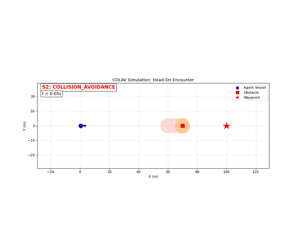
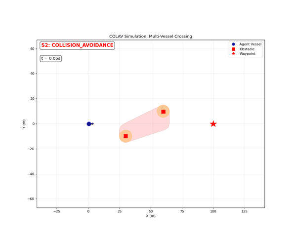
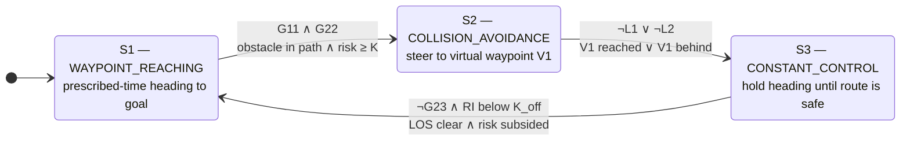
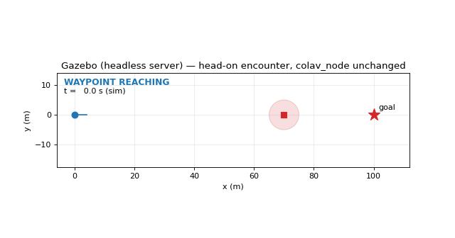
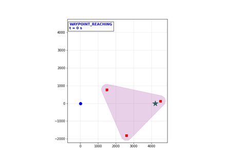

# USV Navigation - Collision Avoidance Automaton

[](https://github.com/michaelstolberger27/usv-navigation/actions/workflows/ci.yml)
[](https://github.com/michaelstolberger27/usv-navigation/actions/workflows/ros2.yml)
[](LICENSE)
[](pyproject.toml)

A hybrid automaton-based collision avoidance (COLAV) system for Unmanned Surface Vehicles
(USVs) that provides provably safe autonomous navigation in dynamic environments — validated
across 2000 simulated encounters and real AIS traffic, and deployed as a verified C++ ROS 2 node.

<p align="center">
  
  
</p>

## Highlights

- **0 collisions, 1999/2000 goals reached** on the CommonOcean HandcraftedTwoVesselEncounters
  benchmark (2000 two-vessel encounters with real curving traffic trajectories; the single
  miss timed out of its step budget — no collision), bit-identical across reruns —
  [Evaluation Results](#evaluation-results)
- **A verified C++ port, deployed in ROS 2** — cross-checked against the Python core layer by
  layer, up to a full 842-step avoidance trajectory reproduced **bit-identically**; the `rclcpp`
  node is a drop-in replacement for the Python node — [ros2/](ros2/README.md)
- **Validated on real ship traffic** — a 30-minute, 393-vessel Singapore Strait AIS recording
  replayed deterministically through the automaton — [ais_traffic/](ais_traffic/README.md)
- **Deterministic and candid** — a tick-synchronous runtime gives bit-identical reruns, and the
  failure modes it exposed on real data are documented and pinned as `strict` xfail tests —
  [Known limitations](#known-limitations)

## Table of Contents

- [Overview](#overview)
- [System Architecture](#system-architecture)
- [Evaluation Results](#evaluation-results)
- [Known limitations](#known-limitations)
- [ROS 2 Node and Verified C++ Port](#ros-2-node-and-verified-c-port)
- [Real AIS Traffic Replay](#real-ais-traffic-replay)
- [Getting Started](#getting-started)
- [Running the Tests](#running-the-tests)
- [Project Structure](#project-structure)
- [Documentation](#documentation)
- [Acknowledgments](#acknowledgments)

## Overview

This project implements a **3-state hybrid automaton** that autonomously guides a maritime
vessel toward waypoints while dynamically avoiding obstacles. The system uses prescribed-time
control theory and unsafe set geometry to guarantee collision-free navigation with formal
safety properties — validated with zero collisions across 2000 simulated encounter scenarios,
every result reproducible bit-for-bit (see [Evaluation Results](#evaluation-results)).

The core automaton is pure Python with no simulator dependencies; around it sit three
independent integrations — a [CommonOcean simulator harness](commonocean_integration/README.md)
for large-scale evaluation, a [real AIS traffic adapter](ais_traffic/README.md), and a
[ROS 2 workspace](ros2/README.md) with a verified C++ port.

## System Architecture

The collision avoidance system operates as a **hybrid automaton** with three states:



### State Descriptions

- **S1 (WAYPOINT_REACHING)**: The vessel navigates directly toward its target waypoint using prescribed-time control for guaranteed convergence
- **S2 (COLLISION_AVOIDANCE)**: When obstacles threaten the path, the system computes a virtual waypoint V1 (a vertex of the swept unsafe convex hull, chosen by predicted CPA with a COLREGs starboard preference) and navigates to it safely
- **S3 (CONSTANT_CONTROL)**: A transition state that holds the current heading while verifying the avoidance maneuver is complete

### Guard Conditions

- **G11**: Line-of-sight (LOS) to waypoint intersects unsafe regions — cone radius equals `Cs` so any obstacle within the safety radius of the path triggers the guard
- **G22**: Risk index `RI(DCPA, TCPA, d_s) = ⅓·(F(DCPA) + F(TCPA) + F(d_s)) ≥ K` — a nonlinear assessment of closest-point-of-approach distance, time, and range that triggers avoidance early and smoothly (COLREGs Rule 8)
- **L1**: Vessel has not yet reached virtual waypoint V1 (pure distance check)
- **L2**: Virtual waypoint V1 is ahead of the vessel (within ±90° of heading)
- **G23**: The obstacle's unsafe region still intersects the LOS to the waypoint (resume check)
- **K_off hysteresis**: Resuming from S3 additionally requires the risk index to drop below `K_off < K`. Without it, a still-converging obstacle can re-trigger avoidance the instant the ship resumes, causing rapid S2/S3/S1 cycling with a freshly recomputed V1 each time — observed as both collisions and non-reproducible outcomes before the fix

Full guard math, controller details, and the parameter reference:
[docs/design.md](docs/design.md).

## Evaluation Results

Evaluated on the CommonOcean **HandcraftedTwoVesselEncounters** dataset (2000 two-vessel
encounter scenarios with real curving traffic trajectories; ego `Cs=300 m`, `tp=3 s`,
`dt=1 s`):

| Metric | Result |
|---|---|
| Collisions | **0 / 2000** |
| Goal reached | 1999 / 2000 |
| Scenarios with avoidance activated | 814 |
| Average CPA during avoidance | ~556 m |

Successive design iterations on this dataset (collisions / goal failures): 16 / 21 (V1 from
current obstacle positions) → 1 / 5 (V1 from a horizon-capped swept region) → 1 / 1 (adding
the `K_off` resume hysteresis, see [Guard Conditions](#guard-conditions)) → **0 / 1** (the
[deterministic runtime](src/colav_automaton/sync_runtime.py), which removed the last collision
and made every result reproducible). The one remaining failure is a no-collision miss
(avoided safely at 532 m CPA but did not reach the goal in the step budget), see
[Known limitations](#known-limitations). A 25-scenario MarineCadastre (AIS-derived) set is
also evaluated — see [commonocean_integration/](commonocean_integration/README.md).

These figures are from the tick-synchronous runtime and are bit-identical across reruns; the
earlier wall-clock async runtime produced the 1-collision row above and varied run to run.

## Known limitations

Documented deliberately — the first two were discovered by replaying a 30-minute recording
of real Singapore Strait AIS traffic (393 vessels) against the automaton, and both are
reproduced deterministically as `strict` xfail tests in
[`tests/test_behaviour_regression.py`](tests/test_behaviour_regression.py), so the suite
flags the moment a fix lands:

- **Dense traffic degenerates the unified unsafe region.** Guard geometry builds *one*
  convex hull over all obstacles. With many scattered vessels (a busy strait), that hull
  covers the whole area: G11 reports a blocked path even when the corridor between traffic
  lanes is genuinely clear, and the resume check ¬G23 can never pass. Fix direction:
  per-obstacle regions (a union, not a hull) or obstacle clustering for guard checks.
- **The resume hysteresis is global.** Leaving S3 requires the *maximum* risk index over
  all obstacles to drop below `K_off`; in steady traffic someone is always approaching, so
  the vessel can stay frozen on its held heading long after the threat that triggered
  avoidance has passed. Fix direction: per-threat hysteresis (resume when the risk from the
  obstacle(s) that triggered avoidance subsides).
- **Overtaking clearance sits close to `Cs`.** At the evaluation scale the overtaking pass
  clears the slow vessel at roughly the safety radius (~300-310 m across sampled
  geometries) rather than with a wide margin, because the vessel cuts back toward its track
  after passing the virtual waypoint.
- **One evaluation miss remains** (`T-1964`): avoided safely (CPA 532 m) but did not reach
  the goal within the step budget.

## ROS 2 Node and Verified C++ Port

The [`ros2/`](ros2/) colcon workspace deploys the same deterministic core as a
time-triggered ROS 2 node (tested on ROS 2 Jazzy):

- **`colav_ros`** — Python `rclpy` node stepping `SyncColavRuntime.step_external` on a
  fixed-rate timer, plus a closed-loop `fake_world` plant/traffic node and a demo launch file.
- **`colav_cpp`** — `colav_core`, a simulator- and ROS-free C++17 reimplementation of the
  controller (prescribed-time law, risk index, geometry guards, V1 selection, runtime),
  cross-checked against the Python core by five gtest suites: control law bit-exact
  1000/1000, guard decisions identical 1500/1500, and a full 842-step head-on trajectory
  **bit-identical** in positions, headings, modes, and transitions. A C++ `rclcpp` node
  links it as a drop-in replacement for the Python node on the same topics.
- **`colav_interfaces`** — the `Obstacle`/`ObstacleArray` messages both nodes speak.

The controller depends only on the topic contract, demonstrated by the bundled
**headless Gazebo world**: `gazebo_demo.launch.py` swaps `fake_world` for a Gazebo
Harmonic server through `ros_gz_bridge` with the controller node unchanged — pure
topic remapping plus `use_sim_time`:

<p align="center">
  
</p>

A `launch_testing` smoke test brings up the node pair and asserts the full
avoid/hold/resume cycle over the wire; a dedicated CI workflow builds the
workspace and runs all of its tests (the five C++ cross-check suites plus the
smoke test) in a `ros:jazzy` container on every push.

Build, run, and verification details: [`ros2/README.md`](ros2/README.md).

## Real AIS Traffic Replay

The [`ais_traffic/`](ais_traffic/) adapter feeds **AIS vessel traffic** into the automaton —
recorded or live from [aisstream.io](https://aisstream.io) — with no simulator required.
A per-vessel tracking layer dead-reckons between sparse AIS reports (2-30+ s apart) and
expires stale tracks, so the automaton consumes clean per-tick obstacle states; recordings
replay bit-identically. Replaying real Singapore Strait traffic through the automaton is
what surfaced the first two [known limitations](#known-limitations).

```bash
# Replay the bundled sample scenario (Singapore Strait geometry)
PYTHONPATH=src:. python3 ais_traffic/scripts/run_replay.py
```

<p align="center">
  
</p>

Recording your own traffic, replay flags, and the tracking layer:
[`ais_traffic/README.md`](ais_traffic/README.md).

## Getting Started

Requires Python 3.10+. Core dependencies (`numpy`, `shapely`, and the
`hybrid-automaton` / `colav-unsafe-set` algorithm packages) install automatically;
`[viz]` adds matplotlib for the animated examples:

```bash
git clone https://github.com/michaelstolberger27/usv-navigation.git
cd usv-navigation
pip install -e .[viz]
```

### Minimal example

Step the automaton tick-by-tick in sim time with the deterministic synchronous
runtime — identical inputs give bit-identical trajectories:

```python
import numpy as np
from colav_automaton import SyncColavRuntime

rt = SyncColavRuntime(
    waypoint=(5000.0, 0.0),
    obstacles=[(2500.0, 0.0, 5.0, np.pi)],   # (x, y, velocity, heading)
    initial_state=(0.0, 0.0, 0.0),           # [x, y, heading]
    Cs=300.0, v=6.0, tp=3.0,
)
while not rt.goal_reached():
    result = rt.step(dt=1.0, obstacles=current_obstacle_states())
    print(result.t, result.mode, result.state)
```

The original async wall-clock runtime and the full parameter reference are in
[docs/design.md](docs/design.md).

### Animated examples (no Docker)

```bash
python examples/realtime_simulation.py --scenario 3    # head-on encounter
python examples/realtime_simulation.py --all           # all six scenarios
```

Six predefined scenarios (stationary obstacle, crowded environment, head-on, crossing,
overtaking, multi-vessel crossing — the GIFs above are scenarios 3 and 6); `--no-unsafe`
hides the unsafe-region overlay.

### Simulator evaluation

Large-scale evaluation against CommonOcean scenario datasets runs in a Docker stack
(commonocean-sim + Gurobi + VNC): see
[`commonocean_integration/README.md`](commonocean_integration/README.md).

## Running the Tests

The pytest suite covers the guard conditions (paper eq 13-27), the risk-index
hysteresis, V1 selection, the unsafe-set geometry wrappers, the AIS tracking layer,
and an end-to-end behavioural regression suite: canonical COLREGs encounters
(head-on, crossing give-way, overtaking) run on the deterministic runtime with
transition sequences, starboard manoeuvres, and minimum separation pinned — plus
the [Known limitations](#known-limitations) reproduced as strict xfail tests:

```bash
pip install -e .[dev]
pytest
```

No simulator or Docker is required. CI runs ruff and the suite on Python 3.10 and
3.12 on every push (see `.github/workflows/ci.yml`).

## Project Structure

```
usv-navigation/
├── src/colav_automaton/          # Core automaton — pure Python, no simulator dependencies
│   ├── automaton.py              #   async automaton factory (hybrid-automaton framework)
│   ├── sync_runtime.py           #   deterministic tick-synchronous runtime (SyncColavRuntime)
│   ├── controllers/              #   prescribed-time law, virtual waypoint V1, unsafe-set geometry
│   ├── guards/                   #   transition guards (G11∧G22, ¬L1∨¬L2, ¬G23 + K_off) + risk index
│   ├── dynamics/ resets/ invariants/
│   └── _compat.py                #   normalizes the unsafe-set dependency's CPA sign convention
├── commonocean_integration/      # Simulator adapter + batch evaluation (Docker) — see its README
├── ais_traffic/                   # Real AIS traffic replay, recorded + live — see its README
├── ros2/                         # ROS 2 workspace: Python & C++ nodes, Gazebo demo — see its README
├── examples/                     # Standalone animated simulation (no Docker required)
├── tests/                        # Unit + behavioural regression suite
├── docs/design.md                # Component-level design reference
├── docker/                       # CommonOcean simulation stack (Dockerfile, compose, start.sh)
└── .github/workflows/            # CI: ruff + pytest, and the ROS 2 colcon build + tests
```

## Documentation

| Document | Contents |
|---|---|
| [docs/design.md](docs/design.md) | Automaton parameters, both runtimes, guard math, controllers |
| [ros2/README.md](ros2/README.md) | ROS 2 build/run, C++ port verification, Gazebo demo |
| [commonocean_integration/README.md](commonocean_integration/README.md) | Docker stack, scenario runs, batch evaluation, visualization |
| [ais_traffic/README.md](ais_traffic/README.md) | Recording and replaying AIS traffic, the tracking layer |

## Acknowledgments

- `hybrid_automaton`: Hybrid system modelling framework with async runtime
- `colav_unsafe_set`: Unsafe set computation and obstacle metric calculation (DCPA/TCPA)
- [commonocean-sim](https://github.com/CommonOcean/commonocean-sim): Maritime scenario simulator used for evaluation
