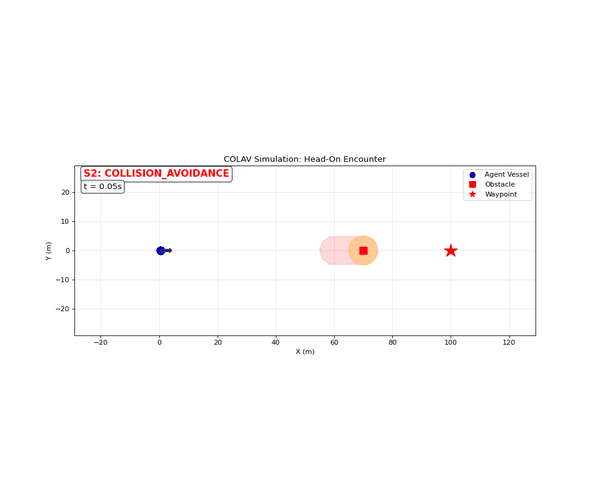
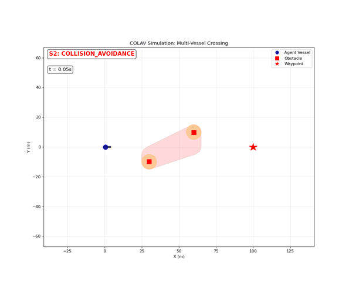
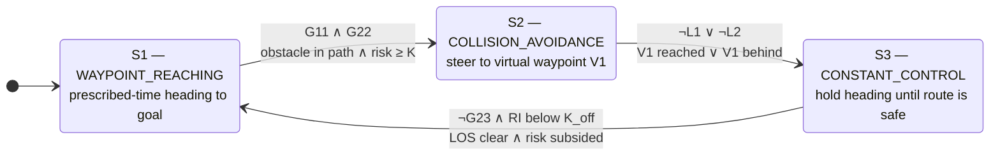

# USV Navigation - Collision Avoidance Automaton

[](https://github.com/michaelstolberger27/usv-navigation/actions/workflows/ci.yml)
[](https://github.com/michaelstolberger27/usv-navigation/actions/workflows/ros2.yml)
[](LICENSE)
[](pyproject.toml)

A hybrid automaton-based collision avoidance (COLAV) system for Unmanned Surface Vehicles (USVs) that provides provably safe autonomous navigation in dynamic environments.

<p align="center">
  
  
</p>

## Table of Contents

- [Overview](#overview)
- [System Architecture](#system-architecture)
- [Installation](#installation)
- [Quick Start](#quick-start)
  - [Basic Usage](#basic-usage)
  - [Running Examples](#running-examples)
  - [AIS Replay (real ship traffic)](#ais-replay-real-ship-traffic)
  - [Testing with CommonOcean Simulator](#testing-with-commonocean-simulator)
  - [Batch Evaluation](#batch-evaluation)
  - [Visualization](#visualization)
- [ROS 2 Node and Verified C++ Port](#ros-2-node-and-verified-c-port)
- [Evaluation Results](#evaluation-results)
- [Running the Tests](#running-the-tests)
- [Project Structure](#project-structure)
- [Key Components](#key-components)
  - [Automaton Factory](#automaton-factory)
  - [State Dynamics](#state-dynamics)
  - [Guards & Collision Detection](#guards--collision-detection)
  - [Controllers](#controllers)
- [Algorithm References](#algorithm-references)
- [Acknowledgments](#acknowledgments)

## Overview

This project implements a **3-state hybrid automaton** that autonomously guides a maritime vessel toward waypoints while dynamically avoiding obstacles. The system uses prescribed-time control theory and unsafe set geometry to guarantee collision-free navigation with formal safety properties.

### Key Features

- **Formal Safety Guarantees**: Uses unsafe set theory with convex hull geometry for provably safe collision avoidance
- **Prescribed-Time Control**: Guaranteed convergence to waypoints within predefined time horizons
- **Multi-Obstacle Support**: Handles multiple static and dynamic obstacles simultaneously
- **Dynamic Obstacle Prediction**: Accounts for obstacle motion and trajectory prediction
- **Real-Time Visualization**: Live animated simulation with state visualization and unsafe set display
- **Deterministic Runtime**: tick-synchronous executive (`SyncColavRuntime`) with bit-identical reruns — same guards/resets/dynamics as the async runtime, no wall-clock dependence
- **Modular Architecture**: Clean separation of core automaton logic from simulator/AIS integrations

## System Architecture

The collision avoidance system operates as a **hybrid automaton** with three states:



### State Descriptions

- **S1 (WAYPOINT_REACHING)**: The vessel navigates directly toward its target waypoint using prescribed-time control for guaranteed convergence
- **S2 (COLLISION_AVOIDANCE)**: When obstacles threaten the path, the system computes a virtual waypoint V1 (a vertex of the swept unsafe convex hull, chosen by predicted CPA with a COLREGs starboard preference) and navigates to it safely
- **S3 (CONSTANT_CONTROL)**: A transition state that holds the current heading while verifying the avoidance maneuver is complete

### Guard Conditions

- **G11**: Line-of-sight (LOS) to waypoint intersects unsafe regions — cone radius equals `Cs` so any obstacle within the safety radius of the path triggers the guard
- **G22**: Risk index `RI(DCPA, TCPA, d_s) = ⅓·(F(DCPA) + F(TCPA) + F(d_s)) ≥ K` — a nonlinear assessment of closest-point-of-approach distance, time, and range that triggers avoidance early and smoothly (COLREGs Rule 8)
- **L1**: Vessel has not yet reached virtual waypoint V1 (pure distance check)
- **L2**: Virtual waypoint V1 is ahead of the vessel (within ±90° of heading)
- **G23**: The obstacle's unsafe region still intersects the LOS to the waypoint (resume check)
- **K_off hysteresis**: Resuming from S3 additionally requires the risk index to drop below `K_off < K`. Without it, a still-converging obstacle can re-trigger avoidance the instant the ship resumes, causing rapid S2/S3/S1 cycling with a freshly recomputed V1 each time — observed as both collisions and non-reproducible outcomes before the fix

## Installation

### Prerequisites

- Python 3.10+
- NumPy, Shapely, Matplotlib

### Required Packages

```bash
pip install -e .[viz]
```

### External Dependencies

- `hybrid_automaton`: Hybrid automaton framework with state, transition, decorator support, and async runtime
- `colav_unsafe_set`: Unsafe set computation and obstacle metric calculation (DCPA/TCPA)

### Setup

```bash
git clone <repository-url>
cd usv-navigation
pip install -e .[viz]
```

## Quick Start

### Basic Usage

```python
import asyncio
import numpy as np
from colav_automaton import ColavAutomaton, HeadingControlProvider
from hybrid_automaton import Automaton, RunResult

async def main():
    ha: Automaton = ColavAutomaton(
        waypoint_x=10.0,
        waypoint_y=9.0,
        obstacles=[(5.0, 4.5, 0.0, 0.0)],  # (x, y, velocity, heading)
        Cs=2.0,   # Safety radius (meters)
        v=12.0,   # Vessel velocity (m/s)
        tp=1.0    # Prescribed time (seconds)
    )

    controller = HeadingControlProvider(ha)

    results: RunResult = await ha.activate(
        initial_continuous_state=np.array([0.0, 0.0, 0.0]),  # [x, y, heading]
        initial_control_input_states={'u': np.array([0.0])},
        enable_real_time_mode=False,
        enable_self_integration=True,
        delta_time=0.1,
        timeout_sec=15.0,
        continuous_state_sampler_enabled=True,
        continuous_state_sampler_rate=100,
        control_states_provider=controller,
        control_states_provision_rate=100,
    )

    print(results)

asyncio.run(main())
```

#### Deterministic synchronous usage

For reproducible simulation and analysis (and as the basis for new
integrations), step the automaton tick-by-tick in sim time — identical
inputs give bit-identical trajectories:

```python
import numpy as np
from colav_automaton import SyncColavRuntime

rt = SyncColavRuntime(
    waypoint=(5000.0, 0.0),
    obstacles=[(2500.0, 0.0, 5.0, np.pi)],   # (x, y, velocity, heading)
    initial_state=(0.0, 0.0, 0.0),           # [x, y, heading]
    Cs=300.0, v=6.0, tp=3.0,
)
while not rt.goal_reached():
    result = rt.step(dt=1.0, obstacles=current_obstacle_states())
    print(result.t, result.mode, result.state)
```

### Running Examples

#### Real-Time Animated Simulation

Run predefined scenarios and save animations as GIFs (no Docker required):

```bash
python examples/realtime_simulation.py                  # Default scenario (1)
python examples/realtime_simulation.py --scenario 3     # Specific scenario
python examples/realtime_simulation.py --all            # Run all scenarios
python examples/realtime_simulation.py --no-unsafe      # Hide unsafe region overlay
```

**Available Scenarios:**
1. Single Stationary Obstacle
2. Multiple Obstacles (Crowded Environment)
3. Head-On Encounter
4. Crossing Encounter
5. Overtaking Encounter
6. Multi-Vessel Crossing

### AIS Replay (real ship traffic)

The [`ais_replay/`](ais_replay/) adapter feeds **AIS vessel traffic** into the automaton —
recorded or live — with no simulator required:

```bash
# Replay the bundled sample scenario (Singapore Strait geometry)
PYTHONPATH=src:. python3 ais_replay/scripts/run_replay.py

# Record real traffic from aisstream.io (free API key), then replay it
PYTHONPATH=src:. python3 ais_replay/scripts/record_ais.py \
    --bbox 1.15,103.7,1.35,104.1 --duration 1800 --out strait.jsonl
PYTHONPATH=src:. python3 ais_replay/scripts/run_replay.py \
    --recording strait.jsonl --ego-start 1.20,103.85 --goal 1.20,103.95
```

<p align="center">
  
</p>

AIS reports arrive sparsely (2-30+ s per vessel), so a per-vessel **tracking layer**
dead-reckons between updates and expires stale tracks — the automaton keeps consuming
clean per-tick obstacle states. Recordings are raw aisstream.io JSONL, replayed
bit-identically. Live mode (`AISStreamSource`) needs `pip install -e .[ais]`.

### Testing with CommonOcean Simulator

The COLAV automaton integrates with [commonocean-sim](https://github.com/CommonOcean/commonocean-sim) via the adapter layer in `commonocean_integration/`. A Docker setup provides the full simulation stack (commonocean-sim, Gurobi, VNC) pre-configured.

**Start the container:**

```bash
# Interactive shell
docker/start.sh -it

# Or detached (access via VNC at http://localhost:6080/vnc.html)
docker/start.sh
```

**Run a head-on collision test** (COLAV vessel East-bound vs MPC vessel West-bound):

```bash
cd /app/commonocean-sim/src
python3 /app/usv-navigation/commonocean_integration/scripts/commonocean_collision_test.py
```

Saves a trajectory plot and animated GIF to `/app/usv-navigation/output/`.

**Run a single CommonOcean XML scenario:**

```bash
cd /app/commonocean-sim/src
python3 /app/usv-navigation/commonocean_integration/scripts/commonocean_scenario.py
python3 /app/usv-navigation/commonocean_integration/scripts/commonocean_scenario.py <path.xml>
```

The first planning problem is controlled by the COLAV automaton; remaining vessels and dynamic obstacles are handled by commonocean-sim defaults.

> **Note:** Traffic trajectories are automatically interpolated from the scenario's 10s timestep to the simulation's 1s timestep so both vessels use the same physical time rate.

### Batch Evaluation

Evaluate the COLAV automaton across a large set of CommonOcean XML scenarios:

```bash
cd /app/commonocean-sim/src

# Run all scenarios
python3 /app/usv-navigation/commonocean_integration/scripts/batch_evaluate.py

# Quick test with a small subset
python3 /app/usv-navigation/commonocean_integration/scripts/batch_evaluate.py --limit 10

# Resume a previous run (skips already-completed scenarios)
python3 /app/usv-navigation/commonocean_integration/scripts/batch_evaluate.py --resume

# Custom scenarios directory and output
python3 /app/usv-navigation/commonocean_integration/scripts/batch_evaluate.py \
    --scenarios-dir /app/scenarios \
    --output-dir /app/usv-navigation/output/batch_eval \
    --limit 50 --start 0
```

Results are saved incrementally to `output/batch_eval/results.csv` with per-scenario metrics including CPA distance, goal reached, collision detected, encounter type, and automaton state time distribution. Summary plots are generated on completion.

There are three batch runners, one per dataset (they differ in how traffic trajectories are sourced): `batch_evaluate.py` (generic), `batch_evaluate_handcrafted.py` (pre-computed trajectories from the XML), and `batch_evaluate_marine_cadastre.py` (straight-line traffic synthesized from AIS-derived planning problems). All support `--limit`, `--start`, `--scenario-ids`, `--resume`, and `--max-runtime`.

### Visualization

The simulation generates trajectory plots and animations showing:

- **Vessel trajectory** with state-based colouring (Blue: S1, Red: S2, Orange: S3)
- **Obstacle positions** with safety radius circles
- **Unsafe set regions** (convex hulls)
- **Virtual waypoint V1** (when in avoidance mode)
- **Heading arrows** on the ego vessel
- **Current state indicator** (S1/S2/S3) with time readout

## ROS 2 Node and Verified C++ Port

The [`ros2/`](ros2/) colcon workspace deploys the same deterministic core as a
time-triggered ROS 2 node (tested on ROS 2 Jazzy):

- **`colav_ros`** — Python `rclpy` node stepping `SyncColavRuntime.step_external` on a
  fixed-rate timer, plus a closed-loop `fake_world` plant/traffic node and a demo launch file.
- **`colav_cpp`** — `colav_core`, a simulator- and ROS-free C++17 reimplementation of the
  controller (prescribed-time law, risk index, geometry guards, V1 selection, runtime),
  cross-checked against the Python core by five gtest suites: control law bit-exact
  1000/1000, guard decisions identical 1500/1500, and a full 842-step head-on trajectory
  **bit-identical** in positions, headings, modes, and transitions. A C++ `rclcpp` node
  links it as a drop-in replacement for the Python node on the same topics.
- **`colav_interfaces`** — the `Obstacle`/`ObstacleArray` messages both nodes speak.

The controller depends only on the topic contract, demonstrated by the bundled
**headless Gazebo world**: `gazebo_demo.launch.py` swaps `fake_world` for a Gazebo
Harmonic server through `ros_gz_bridge` with the controller node unchanged — pure
topic remapping plus `use_sim_time`:

<p align="center">
  
</p>

A `launch_testing` smoke test brings up the node pair and asserts the full
avoid/hold/resume cycle over the wire; a dedicated CI workflow builds the
workspace and runs all of its tests (the five C++ cross-check suites plus the
smoke test) in a `ros:jazzy` container on every push.

Build, run, and verification details: [`ros2/README.md`](ros2/README.md).

## Evaluation Results

Evaluated on the CommonOcean **HandcraftedTwoVesselEncounters** dataset (2000 two-vessel
encounter scenarios with real curving traffic trajectories; ego `Cs=300 m`, `tp=3 s`,
`dt=1 s`):

| Metric | Result |
|---|---|
| Collisions | **0 / 2000** |
| Goal reached | 1999 / 2000 |
| Scenarios with avoidance activated | 814 |
| Average CPA during avoidance | ~556 m |

Successive design iterations on this dataset (collisions / goal failures): 16 / 21 (V1 from
current obstacle positions) → 1 / 5 (V1 from a horizon-capped swept region) → 1 / 1 (adding
the `K_off` resume hysteresis, see [Guard Conditions](#guard-conditions)) → **0 / 1** (the
[deterministic runtime](#deterministic-synchronous-usage), which removed the last collision
and made every result reproducible). The one remaining failure is a no-collision miss
(avoided safely at 532 m CPA but did not reach the goal in the step budget), see
[Known limitations](#known-limitations). A 25-scenario MarineCadastre (AIS-derived) set is
also evaluated via `batch_evaluate_marine_cadastre.py`.

These figures are from the tick-synchronous runtime and are bit-identical across reruns; the
earlier wall-clock async runtime produced the 1-collision row above and varied run to run.

## Known limitations

Documented deliberately — the first two were discovered by replaying a 30-minute recording
of real Singapore Strait AIS traffic (393 vessels) against the automaton, and both are
reproduced deterministically as `strict` xfail tests in
[`tests/test_behaviour_regression.py`](tests/test_behaviour_regression.py), so the suite
flags the moment a fix lands:

- **Dense traffic degenerates the unified unsafe region.** Guard geometry builds *one*
  convex hull over all obstacles. With many scattered vessels (a busy strait), that hull
  covers the whole area: G11 reports a blocked path even when the corridor between traffic
  lanes is genuinely clear, and the resume check ¬G23 can never pass. Fix direction:
  per-obstacle regions (a union, not a hull) or obstacle clustering for guard checks.
- **The resume hysteresis is global.** Leaving S3 requires the *maximum* risk index over
  all obstacles to drop below `K_off`; in steady traffic someone is always approaching, so
  the vessel can stay frozen on its held heading long after the threat that triggered
  avoidance has passed. Fix direction: per-threat hysteresis (resume when the risk from the
  obstacle(s) that triggered avoidance subsides).
- **Overtaking clearance sits close to `Cs`.** At the evaluation scale the overtaking pass
  clears the slow vessel at roughly the safety radius (~300-310 m across sampled
  geometries) rather than with a wide margin, because the vessel cuts back toward its track
  after passing the virtual waypoint.
- **One evaluation miss remains** (`T-1964`): avoided safely (CPA 532 m) but did not reach
  the goal within the step budget.

## Running the Tests

The pytest suite covers the guard conditions (paper eq 13-27), the risk-index
hysteresis, V1 selection, the unsafe-set geometry wrappers, the AIS tracking layer,
and an end-to-end behavioural regression suite: canonical COLREGs encounters
(head-on, crossing give-way, overtaking) run on the deterministic runtime with
transition sequences, starboard manoeuvres, and minimum separation pinned — plus
the [Known limitations](#known-limitations) reproduced as strict xfail tests:

```bash
pip install -e .[dev]
pytest
```

No simulator or Docker is required. CI runs ruff and the suite on Python 3.10 and
3.12 on every push (see `.github/workflows/ci.yml`).

## Project Structure

```
usv-navigation/
├── src/
│   └── colav_automaton/               # Core automaton — no CommonOcean dependencies
│       ├── __init__.py                # Package exports (ColavAutomaton, SyncColavRuntime, ...)
│       ├── automaton.py               # Automaton factory
│       ├── controllers/
│       │   ├── prescribed_time.py     # Prescribed-time heading controller & HeadingControlProvider
│       │   ├── virtual_waypoint.py    # Virtual waypoint V1 computation (COLREGs-compliant)
│       │   └── unsafe_sets.py         # Unsafe set geometry and LOS cone construction
│       ├── dynamics/
│       │   └── dynamics.py            # State flow dynamics (S1/S2 navigation, S3 constant)
│       ├── guards/
│       │   ├── guards.py              # Transition guards (G11∧G22, ¬L1∨¬L2, ¬G23 + K_off hysteresis)
│       │   └── conditions.py          # Guard conditions (G11, G22, G23, L1, L2, risk index)
│       ├── resets/
│       │   └── resets.py              # State reset handlers (V1 computation & waypoint stack)
│       └── invariants/
│           └── invariants.py          # State invariant conditions
├── commonocean_integration/           # CommonOcean-specific code (requires Docker)
│   ├── sim_utils.py                   # Shared utilities: trajectory interpolation, config loading
│   ├── adapters/
│   │   ├── controller.py              # HybridAutomatonController (commonocean-sim adapter)
│   │   └── vessel_factory.py          # ColavVesselFactory (creates YP-model vessels)
│   ├── evaluation/
│   │   └── metrics.py                 # Per-scenario metrics: CPA, goal reached, encounter type
│   └── scripts/
│       ├── batch_evaluate.py          # Batch runner (generic dataset)
│       ├── batch_evaluate_handcrafted.py      # Batch runner (HandcraftedTwoVesselEncounters)
│       ├── batch_evaluate_marine_cadastre.py  # Batch runner (MarineCadastre AIS scenarios)
│       ├── animate_scenario.py        # Render a scenario run as a GIF (with unsafe-set overlay)
│       ├── commonocean_scenario.py    # Single scenario runner with pyglet display
│       ├── commonocean_collision_test.py  # Head-on collision test + GIF output
│       └── plot_trajectories.py       # Trajectory plot generator for selected scenarios
├── ais_replay/                        # AIS traffic adapter (recorded replay + aisstream.io live)
│   ├── geo.py                         # lat/lon <-> local metric frame
│   ├── tracker.py                     # Per-vessel dead-reckoning tracker (sparse AIS -> per-tick states)
│   ├── sources.py                     # RecordedAISSource (JSONL), AISStreamSource (websocket)
│   ├── runner.py                      # Drives the automaton through AIS traffic
│   ├── sample_data/                   # Bundled synthetic recording (aisstream.io format)
│   └── scripts/                       # run_replay.py, record_ais.py
├── ros2/                              # ROS 2 colcon workspace (see ros2/README.md)
│   └── src/
│       ├── colav_interfaces/          # Obstacle/ObstacleArray message definitions
│       ├── colav_ros/                 # Python rclpy node, fake_world + Gazebo demo, launch smoke test
│       └── colav_cpp/                 # colav_core C++ port + rclcpp node + gtest cross-checks
├── examples/
│   └── realtime_simulation.py         # Standalone animated simulation (no Docker required)
├── tests/                             # Pytest suite: unit + behavioural regression (no simulator needed)
├── .github/workflows/ci.yml           # CI: ruff + pytest (Python 3.10/3.12) on every push
├── docker/
│   ├── Dockerfile                     # Full simulation stack (commonocean-sim + Gurobi + VNC)
│   ├── docker-compose.yml             # Service definition with volume mounts
│   └── start.sh                       # Helper to start/stop the container
├── pyproject.toml
└── README.md
```

## Key Components

### Automaton Factory

The [`ColavAutomaton()`](src/colav_automaton/automaton.py) function creates a configured hybrid automaton:

```python
ColavAutomaton(
    waypoint_x: float,           # Target x-coordinate
    waypoint_y: float,           # Target y-coordinate
    obstacles: list,             # [(x, y, velocity, heading), ...]
    Cs: float = 2.0,            # Safety radius (meters)
    v: float = 12.0,            # Vessel velocity (m/s)
    a: float = 1.67,            # System dynamics parameter
    eta: float = 3.5,           # Controller gain
    tp: float = 1.0,            # Prescribed time (seconds)
    v1_buffer: float = 0.0,     # Virtual waypoint clearance buffer (meters)
    K: float = 0.35,            # Risk-index threshold to enter avoidance (G22)
    K_off: float = 0.25,        # Risk-index threshold to resume from S3 (hysteresis, < K)
)
```

> **Note:** `delta` and `dsafe` are derived automatically:
> - `delta = max(5.0, v * tp * 0.5)` — arrival tolerance
> - `dsafe = Cs + v * tp` — safe distance threshold (paper eq 14)

**CommonOcean evaluation uses:** `Cs=300.0`, `tp=3.0`, `a=1.67`, `eta=3.5` (real-world scale, dt=1s).

**Stability condition:** The prescribed-time controller requires `a * dt < 2` and `tp > dt`. With `a=1.67` and `dt=1.0`: `a*dt = 1.67 < 2` ✓

### State Dynamics

Two continuous dynamics functions in [`dynamics.py`](src/colav_automaton/dynamics/dynamics.py):

- **`waypoint_navigation_dynamics()`**: Shared by S1 and S2 — uses prescribed-time control to navigate toward the current waypoint (goal in S1, virtual waypoint V1 in S2)
- **`constant_control_dynamics()`**: Used by S3 — maintains current heading (zero yaw rate)

### Guards & Collision Detection

Transition logic in [`guards.py`](src/colav_automaton/guards/guards.py) and [`conditions.py`](src/colav_automaton/guards/conditions.py):

**G11 (LOS Intersection Check):**
- Creates a cone from vessel position toward waypoint with radius `Cs` (= safety radius)
- Tests intersection with unsafe set polygon using Shapely
- Any obstacle within `Cs` of the direct path triggers avoidance

**G22 (Risk Assessment):**
- `RI(DCPA, TCPA, d_s) = ⅓·(F(DCPA) + F(TCPA) + F(d_s)) ≥ K` with the paper's piecewise
  quadratic `F(z)` mapping each metric onto [0, 1]
- Triggers avoidance much earlier than a plain distance check for converging traffic

**G23 + K_off (Resume Check with Hysteresis):**
- The ship leaves S3 only when the LOS to the waypoint is clear of the obstacle's unsafe
  region **and** the risk index has dropped below `K_off < K`
- The asymmetric thresholds (enter at `K ≥ 0.35`, resume below `K_off = 0.25`) prevent
  rapid avoid/resume cycling against still-converging traffic

**Post-avoidance waypoint recovery:**
- On S2/S3 → S1 transition, waypoints that are now behind the vessel are skipped automatically, preventing backtracking after an avoidance manoeuvre

### Controllers

#### Prescribed-Time Controller ([`prescribed_time.py`](src/colav_automaton/controllers/prescribed_time.py))

- **`compute_prescribed_time_control()`**: Computes the heading control law guaranteeing convergence to line-of-sight within time `tp`
- **`HeadingControlProvider`**: Async control provider that runs alongside the automaton, computing control input `u` each cycle

#### Virtual Waypoint ([`virtual_waypoint.py`](src/colav_automaton/controllers/virtual_waypoint.py))

- **`compute_v1()`**: Selects the starboard-most unsafe set vertex ahead of the vessel (within ±90° of heading), with optional buffer. COLREGs-compliant starboard preference.

#### Unsafe Set Geometry ([`unsafe_sets.py`](src/colav_automaton/controllers/unsafe_sets.py))

- **`get_unsafe_set_vertices()`**: Convex hull vertices of unsafe regions (with swept region support for moving obstacles)
- **`create_los_cone()`**: Convex cone from vessel toward waypoint for G11 intersection test

## Algorithm References

- **Prescribed-Time Control**: Guaranteed convergence within predefined time horizon
- **Unsafe Set Theory**: Convex hull representation of collision regions
- **Hybrid Automaton Framework**: Formal modelling of discrete state transitions with continuous dynamics
- **COLREGS Compliance**: Starboard avoidance manoeuvres following maritime collision regulations

## Acknowledgments

- `hybrid_automaton`: Hybrid system modelling framework with async runtime
- `colav_unsafe_set`: Unsafe set computation and obstacle metric calculation (DCPA/TCPA)
- [commonocean-sim](https://github.com/CommonOcean/commonocean-sim): Maritime scenario simulator used for evaluation
