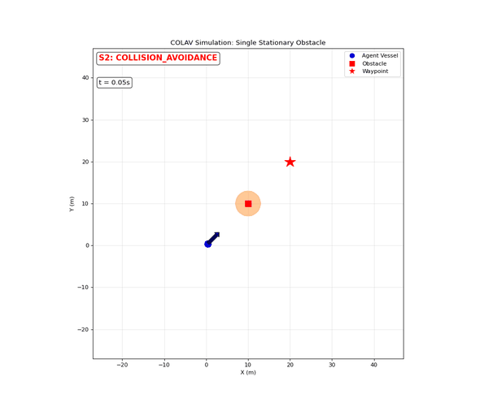
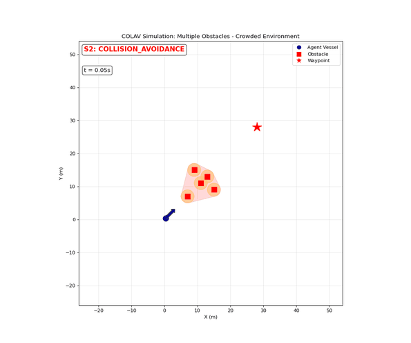
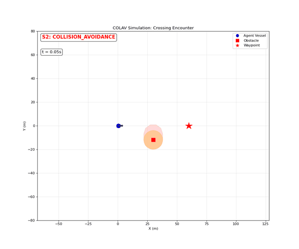
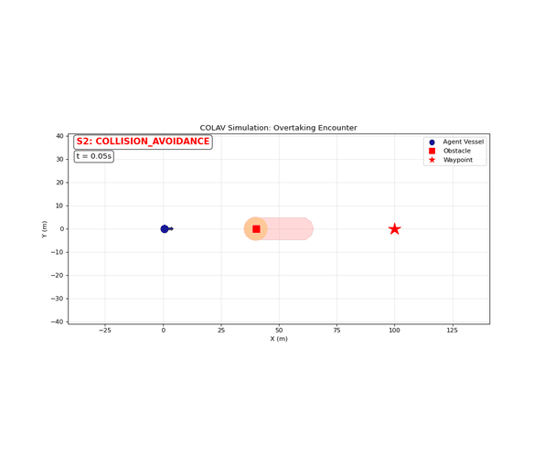

# Examples

[`realtime_simulation.py`](realtime_simulation.py) runs the COLAV automaton on six
predefined encounter scenarios with a live animated display — no Docker or simulator
required — and saves each run as a GIF:

```bash
pip install -e .[viz]                                 # matplotlib
python realtime_simulation.py --scenario 3            # one scenario
python realtime_simulation.py --all                   # all six
python realtime_simulation.py --scenario 3 --no-unsafe  # hide the unsafe-region overlay
```

GIFs are written to `examples/output/` (gitignored); the curated copies below live in
[`docs/assets/`](../docs/assets/).

Each animation shows the ego trajectory coloured by automaton state (blue S1
waypoint-reaching, red S2 avoidance, orange S3 constant-control), obstacles with their
safety-radius circles, the unsafe-set convex hull, the virtual waypoint V1 while
avoiding, and a live state/time readout.

## Scenario gallery

| **1 — Single stationary obstacle** | **2 — Multiple obstacles (crowded environment)** |
|---|---|
|  |  |
| **3 — Head-on encounter** | **4 — Crossing encounter** |
|  |  |
| **5 — Overtaking encounter** | **6 — Multi-vessel crossing** |
|  |  |
